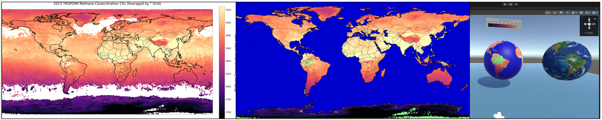
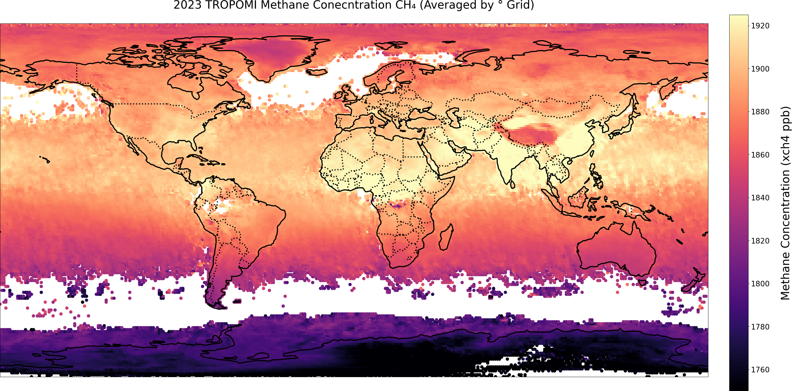
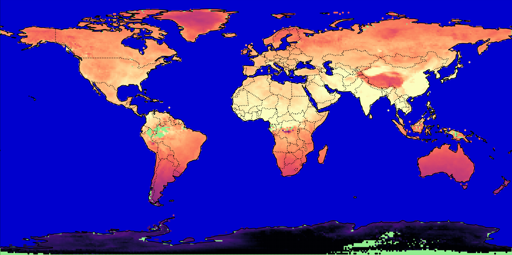

## Climate Data Visualisation Project
This repository contains code and resources for visualising atmospheric climate data on global maps using the TROPOMI satellite.
The outputs of this code can be imported into unity to create 3D interactive visualisations!




## Setup
This code has been tested with 'Python 3.1.0'. 
To get started create an environment using the command:
```
pip install -r requirements.txt
```
Then Clone the repo and download the climate data per instructions below.

## Dowloading Climate Data 
The data used in this project is from the TROPOMI (TROPOspheric Monitoring Instrument) satellite. 
You can download the data that you wish to use from the CEDA data archive and adjust references to data as necessary in the code :  https://catalogue.ceda.ac.uk/uuid/2b8c6a8f1abd40a6b0ce07c40b1c57ff/ 

This project is currently set up to use data from the entire year for 2023.
In the CEDA data archive the processed data files are stored in folders named 01-12 referring to the months January-December. 
There is one file per day. 
These folders 01-12 should be placed in the Data/ folder of this project. 

The entire set of 2023 data can be downloaded using WGET (21.8GB) via the command line with the command: 
```
wget -e robots=off --mirror --no-parent -r https://dap.ceda.ac.uk/neodc/esacci/ghg/data/cci_plus/CH4_S5P_WFMD/v1.8_extended_june2024/2023/ 
```
## Code  
The code consists of a set of notebooks and python script(s). 
The Notebooks are commented and contain markdown information within - they ordered sequentially and build on one another: 

- Notebook 01 - Load and plot global methane data from January 1st 2023
- Notebook 02 - Custom colouring of land and sea with land mask and custom 4K plot resolution
- Notebook 03 - Mean data plotting and exploration (enables plotting of data over multiple days / weeks / months etc.)
- Notebook 04 - Plot custom mean monthly global methane concentration for January 2023 - December 2023
- Script Create_Monthly_Methane_Plots.py - Customisable script for plotting global atmospheric data, user defined script parameters at start of script


## Code  Outputs

 This code can be used to plot atmospheric data such as the below plot of 2023 Global Methane Concentration: 



 We also include customisation code to enable colouring of the land in green / sea in blue and options to plot only land data. 
 Other customisation includes removal of titles and colour bars, enabling figures such as the following to be plotted: 



The 4K resolution figures plotted by this code can be imported into unity for 3D interactive visualisations. We show an example screenshot below. 
Our Unity Code along with a demo will be coming soon in a seperate repo. 


